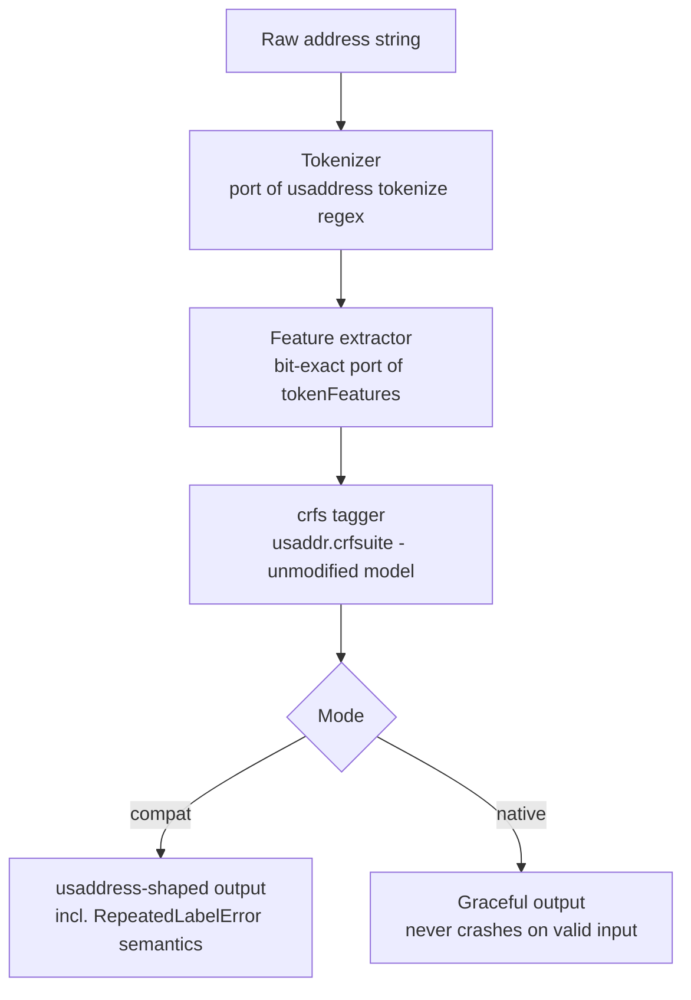
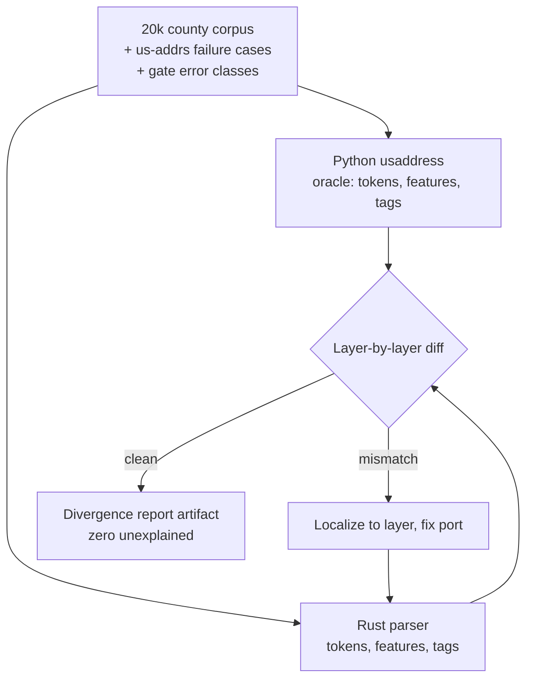

# feat: Rust-core US address parser with exact usaddress parity

**Target repo:** `us-address-parser` (this repo). The origin requirements doc lives outside this repo (path in frontmatter) because the brainstorm predates the repo.

## Summary

Build a compiled US address parser that ships usaddress's own trained CRF model inside a Rust engine — exact parity by construction, no retraining — delivered as a pip-installable drop-in for the Python audience, with the existing benchmark suite extended into public parity and speed evidence. Launch bar: ≥10x single-core over usaddress with zero unexplained divergences on the 20k-address county corpus.

## Problem Frame

The pre-build gate (benchmark/results/GATE-REPORT.md) measured usaddress at ~4–10k addresses/sec single-core with a 0.2–1.5% anomaly rate on county tax-roll data, plus a hard-crash class (saint-name streets). The launch story is therefore speed + robustness with parity as the trust mechanism (see origin, Key Decisions). Research found the enabling fact: the pure-Rust `crfs` crate reads CRFsuite binary models directly, so usaddress's `usaddr.crfsuite` can run unmodified in Rust. Two prior Rust ports exist but neither achieved output parity (us-addrs reports 0.7–21% mismatch) nor shipped Python wheels — the audience with 5.2M monthly downloads is Python users. The unsolved, load-bearing problem is porting usaddress's tokenization and feature extraction *bit-exactly*; the CRF math is not the risk.

---

## Requirements

**Parity and correctness**

- R1. Output-compatibility mode reproduces usaddress's `tag()`/`parse()` results exactly on the 20k-address county corpus — including reproducing `RepeatedLabelError` on the inputs where usaddress raises it (advances origin R1, R4).
- R2. Every remaining divergence on any published dataset is machine-detected and categorized in a generated divergence report; zero divergences may ship unexplained (origin R4).
- R3. The us-addrs project's documented failure cases and the gate report's named error classes (saint-name streets, directional-as-street, range numbers) are explicit regression tests.

**Speed**

- R4. Single-core, like-for-like batch throughput ≥10x usaddress on the benchmark corpus is the launch go/no-go; the published headline number comes from measurement (origin R2).
- R5. Multi-core numbers are published alongside, compared against multiprocessing-parallelized usaddress (origin R2, R5).

**Packaging and distribution**

- R6. `pip install` delivers prebuilt wheels (Windows/macOS/Linux, abi3) with a drop-in API mirroring `usaddress.tag()`/`parse()`; no Rust toolchain required for users (origin R3).
- R7. Install footprint stays small — no multi-GB downloads; RAM well under libpostal's ~2GB (origin R3).

**Evidence and stewardship**

- R8. The existing benchmark suite extends to a three-way comparison (usaddress, this parser via Python, this parser native) and remains reproducible end-to-end (origin R5).
- R9. README and docs credit DataMade/usaddress prominently, credit the prior Rust ports (usaddress-rs, us-addrs), and contain no positioning against vendors (origin R6, R10).
- R10. Permissive license (MIT or Apache-2.0) with verified rights to redistribute the `usaddr.crfsuite` model file (origin R8).

---

## Key Technical Decisions

- **Same trained model, new engine.** v1 loads usaddress's shipped `usaddr.crfsuite` unmodified. Parity is achieved by construction (same weights, same features) rather than by retraining and hoping. The origin's stretch goal (better model, gold labels, R11) stays gated and out of this plan.
- **Pure-Rust CRF inference via the `crfs` crate (v0.4).** Maintained through July 2026; reads CRFsuite binary format; proven against this exact model file by the boydjohnson/usaddress-rs prior art. The `crfsuite` C-bindings crate is used only as a test oracle if inference discrepancies appear — never shipped.
- **Differential testing is the correctness methodology.** Python usaddress is the oracle. Parity is proven layer by layer: tokens first, then feature dicts, then tags — because research shows feature extraction (not CRF math) is where prior ports failed. Feature-level diffs localize bugs that tag-level diffs only reveal.
- **Compat mode replicates, native mode improves.** In compatibility mode the parser reproduces usaddress behavior including its `RepeatedLabelError` crashes (that's what parity means). The native API may handle those inputs gracefully — that improvement is part of the launch story but never conflated with parity claims.
- **PyO3 + maturin, abi3-py310 wheels.** One wheel per OS/arch covers all modern Pythons; `maturin generate-ci github` scaffolds the build matrix. Free-threaded (abi3t) wheels deferred to follow-up.
- **Parity claim scoped to real county data.** ASCII-dominant inputs are the domain; known Python-vs-Rust Unicode differences (casing, regex edge cases) are documented as out-of-parity-scope rather than chased (confirmed at synthesis).
- **Speed bar ≥10x single-core, headline from measurement.** The ~5x us-addrs precedent is the credible floor; exceeding it requires the allocation-free feature extraction and batch API planned in U7. If measurement lands under 10x, launch pauses for an explicit user decision rather than shipping a weak headline.
- **Monorepo.** Rust workspace + Python package + existing benchmark suite in one repo so parity tests, benchmarks, and releases stay in lockstep.

---

## High-Level Technical Design

Parse pipeline (both modes share everything up to output shaping):



Differential parity loop (U2–U5 all run inside it):



## Output Structure

```
us-address-parser/
├── crates/
│   ├── core/            # Rust lib: tokenizer, features, model, tagger, both modes
│   └── python/          # PyO3 bindings crate (maturin project)
├── model/               # vendored usaddr.crfsuite + provenance/license note
├── benchmark/           # existing suite, extended to three-way + parity runner
├── docs/plans/
└── .github/workflows/   # test + wheel builds (maturin-action)
```

Tree is a scope declaration; per-unit Files remain authoritative.

---

## Implementation Units

### U1. Rust workspace and model-loading spike

- Goal: Cargo workspace exists; core crate loads the vendored `usaddr.crfsuite` via `crfs` and tags one hand-built feature sequence, matching labels captured from Python.
- Requirements: R1 (foundation), R10
- Dependencies: none
- Files: `Cargo.toml`, `crates/core/Cargo.toml`, `crates/core/src/lib.rs`, `crates/core/src/model.rs`, `crates/core/tests/model_load.rs`, `model/usaddr.crfsuite`, `model/PROVENANCE.md`
- Approach: copy the model file from the installed usaddress package; record source version and license basis in PROVENANCE.md (verify usaddress's license permits redistribution — expected yes, MIT-family; if not, load-from-installed-package fallback becomes the design).
- Test scenarios: model loads from bytes; tagging a fixture feature sequence for `123 N Main St Springfield IL 62704` returns the exact labels Python produces (fixture generated by a checked-in Python script); missing/corrupt model file yields a clear error.
- Verification: `cargo test` green; fixture provably generated from Python usaddress, not hand-typed.

### U2. Tokenizer port

- Goal: Rust tokenizer reproduces `usaddress.tokenize()` exactly on the corpus.
- Requirements: R1
- Dependencies: U1
- Files: `crates/core/src/tokenize.rs`, `crates/core/tests/tokenize_diff.rs`, `benchmark/dump_oracle.py` (emits token/feature/tag oracles as JSONL)
- Approach: port the tokenize regex semantics (`#`/`&` standalone tokens, trailing punctuation attached); Rust `regex` crate differences from Python `re` are exactly the trap that bit us-addrs — differential tests are the arbiter, not regex-string similarity.
- Execution note: test-first against oracle fixtures dumped from Python before writing the port.
- Test scenarios: zero token-sequence diffs across all 20k corpus rows; edge fixtures — `#` and `&` tokens, trailing commas/semicolons/newlines, multiple spaces, leading/trailing whitespace, empty string.
- Verification: differential runner reports 0 tokenizer diffs on the corpus.

### U3. Feature-extraction port (the risk unit)

- Goal: Rust `token_features()` produces byte-identical feature dicts to Python's `tokenFeatures()` for every token in the corpus.
- Requirements: R1, R3
- Dependencies: U2
- Files: `crates/core/src/features.rs`, `crates/core/src/vocab.rs` (street-type and directional sets), `crates/core/tests/features_diff.rs`
- Approach: port each feature (`abbrev`, `digits`, `word`, `trailing.zeros`, `length`, `endsinpunc`, `directional`, `street_name`, `has.vowels`) plus the previous/next-token context features; ASCII-scope casing (KTD); feature-name strings must match exactly — they are the model's lookup keys.
- Execution note: characterization-first — dump Python's full feature output for the corpus before porting, and diff continuously.
- Test scenarios: zero feature-dict diffs across the corpus; per-feature unit fixtures for numeric tokens, abbreviations with periods, vowel-less tokens, zero-padded numbers, known street types and directionals; first/last token context handling.
- Verification: differential runner reports 0 feature diffs corpus-wide; us-addrs failure cases produce identical features to Python.

### U4. Tag pipeline and dual-mode API

- Goal: end-to-end `tag()`/`parse()` in Rust with compat mode (usaddress-shaped output incl. `RepeatedLabelError` semantics) and native mode (graceful handling, never crashes on valid input).
- Requirements: R1, R3
- Dependencies: U3
- Files: `crates/core/src/tag.rs`, `crates/core/src/api.rs`, `crates/core/tests/tag_diff.rs`
- Approach: replicate usaddress's post-processing (label/token pairing, ordered-dict collapse that raises on repeated labels in compat mode); native mode returns structured results for repeated-label inputs instead of erroring.
- Test scenarios: compat `tag()` equals Python on corpus rows where Python succeeds; compat raises exactly where Python raises (the ST JAMES PLACE class); native mode returns usable output on those same crash inputs.
- Verification: tag-level differential run is clean; the gate report's named error classes behave per mode contract.

### U5. Parity runner and divergence report

- Goal: one command runs the full differential suite over the corpus and emits the public divergence-report artifact (R2's zero-unexplained gate).
- Requirements: R1, R2, R3, R8
- Dependencies: U4
- Files: `benchmark/run_parity.py`, `benchmark/results/parity_report.md` (generated), `benchmark/data/us_addrs_failures.csv` (imported failure cases)
- Approach: runner compares oracle JSONL vs Rust output at all three layers; any divergence gets a category (tokenizer/feature/tag/unicode-scope) and lands in the report; CI fails on uncategorized divergence.
- Test scenarios: seeded artificial divergence is detected and categorized; clean run produces a report stating corpus size, agreement count, and each documented Unicode-scope exclusion.
- Verification: clean corpus run; report artifact renders and is reproducible.

### U6. Python package and wheels

- Goal: `pip install <name>` gives a drop-in module mirroring usaddress's API, backed by the Rust core, with abi3 wheels built in CI for Windows/macOS/Linux.
- Requirements: R6, R7, R10
- Dependencies: U4, U5 (parity runner reused by binding tests)
- Files: `crates/python/Cargo.toml`, `crates/python/src/lib.rs`, `crates/python/pyproject.toml`, `.github/workflows/wheels.yml`, `crates/python/tests/test_dropin.py`
- Approach: PyO3 + maturin, abi3-py310; module exposes `tag()`, `parse()`, and a `RepeatedLabelError` exception type matching usaddress's signature shape; scaffold CI via `maturin generate-ci github`.
- Test scenarios: parity suite passes when driven through the Python binding; exception type is catchable exactly as usaddress's; wheel installs in a clean venv without a Rust toolchain; import time and RSS measured and recorded (R7).
- Verification: CI builds all wheel targets green; `test_dropin.py` passes against an installed wheel.

### U7. Performance pass and three-way benchmark

- Goal: hit the speed bar and produce the launch numbers — single-core like-for-like and multi-core vs multiprocessing usaddress.
- Requirements: R4, R5, R8
- Dependencies: U5, U6
- Files: `crates/core/src/batch.rs`, `benchmark/run_baseline.py` (extend to three-way), `benchmark/results/speed_report.md` (generated)
- Approach: profile first; expected wins are allocation-free feature extraction (interned feature strings, reused buffers), precompiled token classifier replacing regex where behavior-equivalent (differential suite is the referee), and a batch API; optional rayon parallelism for the multi-core number.
- Test scenarios: parity suite still clean after every optimization (optimizations that break parity are reverted, not excused); batch API matches single-call results; benchmark reports both comparisons on the 20k corpus; go/no-go check emits pass/fail against the ≥10x bar.
- Verification: speed report shows measured multipliers; ≥10x single-core met — if not, stop and surface the decision rather than proceeding to U8.

### U8. Docs, credit, and launch-collateral scaffolding

- Goal: repo is public-ready — README, credits, license, reproduction instructions — pending only the name decision and the origin doc's pre-launch questions.
- Requirements: R9, R10
- Dependencies: U7
- Files: `README.md` (rewrite), `LICENSE`, `CONTRIBUTING.md`, `benchmark/README.md`
- Approach: README leads with measured numbers and the parity mechanism; prominent credit to DataMade/usaddress, and to usaddress-rs and us-addrs as prior art whose failure cases hardened this parser; no vendor positioning (origin R10); document the R12 maintenance commitment placeholder pending the release-home decision.
- Test scenarios: none — documentation unit. `Test expectation: none — no behavioral change.`
- Verification: a cold reader can reproduce fetch → parity → benchmark from the README alone; license file present with model-redistribution note.

---

## Scope Boundaries

Carried from origin — **Deferred for later:** multinational parsing; the PySAL spreg second act; any openavmkit/CAMA work; the gold-label eval set and accuracy-improvement stretch (origin R11); the launch post itself (origin R9). **Outside this product's identity:** LLM-wrapper parser; positioning against incumbent vendors; sales-funnel framing.

### Deferred to Follow-Up Work

- Project name and crates.io/PyPI naming (the obvious crate name is taken) — blocks publishing, not building; resolve with the release-home decision from the origin doc.
- Offering the benchmark suite upstream to usaddress (origin R7) — after launch numbers exist.
- Free-threaded (abi3t) wheels, WASM build, standalone CLI.
- R12 maintenance-owner naming — settled with release home.

---

## Risks & Dependencies

- **Parity gap (highest risk).** us-addrs proves feature-extraction drift is easy; mitigation is the layer-by-layer differential methodology (U2–U3 gate U4) and adopting their failure cases as tests. If bit-exactness stalls on a Python-quirk edge, the divergence report mechanism (R2) is the honest fallback.
- **Speed bar miss.** If U7 measures <10x single-core, launch pauses for an explicit decision (reframe vs optimize further); the plan does not ship a weak headline.
- **crfs crate correctness.** Low risk (prior art); if inference mismatches appear, cross-check against the CRFsuite C bindings as oracle before suspecting the port.
- **Model redistribution.** PROVENANCE.md check in U1; fallback design (load from user's installed usaddress) documented if redistribution is not permitted.
[redacted pre-launch]

---

## Sources & Research

- Origin requirements: frontmatter path; gate evidence: `benchmark/results/GATE-REPORT.md`
- crfs crate (pure-Rust CRFsuite inference): github.com/messense/crfs-rs — v0.4, active Jul 2026
- usaddress internals (tokenize/tokenFeatures/label set): github.com/datamade/usaddress
- Prior art: github.com/boydjohnson/usaddress-rs (proves model-loading approach); github.com/raphaellaude/us-addrs (~5x speed, 0.7–21% mismatch — failure corpus + speed floor)
- Packaging: github.com/PyO3/maturin, maturin-action; abi3 + 2026 free-threaded wheel notes
