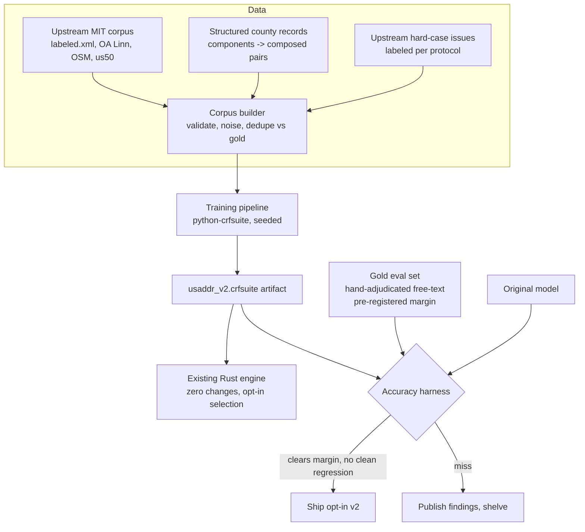

# feat: Model v2 — retrained CRF for accuracy and speed

## Summary

Train a successor CRF model on a much larger corpus — upstream's public MIT training data, distant-supervised pairs generated from structured county records, and hand-labeled hard cases — evaluated against a new independently-auditable gold-standard set (origin R11), shipped opt-in beside the pinned original model. v2 ships only if it clears the pre-registered margin on the gold set AND does not regress on the pre-registered clean-data eval. Accuracy on messy county data is the primary axis (per the user's charter, speed is the explicit second axis: feature pruning is measured, kept only if accuracy-neutral). The model artifact needs no new inference math, but dual-model support is a real engine refactor (see U6).

## Problem Frame

112 of the 170 open upstream issues are model-accuracy complaints (two-word places, directionals, highways) — 66% of all reported pain, untouchable in v1 because parity froze the model by design. The unlock: usaddress's full training corpus is public and MIT-licensed in its repo (verified 2026-08-13: `training/labeled.xml` 428KB, `openaddress_us_ia_linn.xml` 28MB, synthetic OSM sets, hand-labeled us50 sets), so retraining extends a reproducible pipeline rather than reverse-engineering one. And this project holds an asset upstream never used: the benchmark fetchers pull *component-level* fields (house number, street, city, state, zip separated at the source), which converts public county data into auto-labeled training pairs at whatever scale we want. The opt-in second model adds accuracy without ever breaking the parity promise that anchors the project's credibility.

---

## Requirements

**Evaluation first (the R11 gate)**

- R1. A gold-standard eval set of hand-adjudicated messy addresses exists before any training run: sampled from true free-text sources (county mailing addresses, upstream-issue hard cases, us-addrs cases), with a published labeling protocol, adjudication rules for ambiguous addresses, and strict separation from all training data (origin R11).
- R2. Both gates are pre-registered in the protocol before training begins: the exact-match improvement v2 must show on the gold set, AND the clean-data eval (upstream's held-out `measure_performance/test_data`, excluded from all training corpora) with its allowed regression bound — so neither bar can move after results exist.
- R3. An accuracy harness scores any model file — passed as a runtime `--model <path>` argument — on the gold set and the clean set (full-address exact match plus per-label precision/recall) reproducibly.

**Training**

- R4. The training pipeline is script-reproducible end to end: corpus assembly → training → a standard `.crfsuite` artifact format-compatible with the engine's loader (runtime loading of candidate artifacts is new harness capability built in U2; embedding the winner is U6).
- R5. The distant-supervision generator validates components, applies realistic noise transforms (casing, punctuation, component dropout, format variation), draws from a wider geographic base than the current four sources, and dedupes against the gold set by address identity.

**Shipping**

- R6. v2 keeps the 26-label schema and the existing feature pipeline; pruning may remove attributes but never changes feature semantics.
- R7. v2 is opt-in (model selection in the API); the default and compat mode stay pinned to the original model, and the v1 parity suite passes untouched.
- R8. Go/no-go: v2 ships only if it clears the pre-registered margin on the gold set AND stays within the pre-registered regression bound on the clean set. A miss is published as findings and the U6 selection path is reverted or feature-disabled before any release — "shelved" is a mechanical outcome, not withheld documentation.

**Speed and claims**

- R9. Feature pruning is measured on both axes; it stays only if accuracy-neutral on the gold set.
- R10. No public accuracy claim before the eval set and protocol are published (origin R10's honesty posture extended to R11).

## Key Technical Decisions

- **Same architecture, new weights.** Retrain the 26-label CRF rather than going neural: the 10x engine, drop-in schema, and model file format all carry over with zero engine changes, and CRF training runs on a laptop CPU. The accuracy ceiling is lower than a neural model's; R8's gate decides whether it's enough (confirmed at synthesis).
- **Eval-first sequencing.** The gold set and pre-registered margin come before any training run. This kills metric shopping and makes the eventual claim auditable — the same discipline that made the speed claim credible.
- **Distant supervision from structured county records.** Components are joined into raw strings with deliberate noise so the model sees realistic mess at scale. Known bias: composed text is not true free-text — which is exactly why the gold set is drawn from genuine free-text sources and results are reported split by source type.
- **Hard-case mining from the upstream tracker.** The 112 accuracy issues enumerate real-world failure classes (saint-names, "La/LA", directionals-as-streets, highways); each becomes labeled eval and/or training material under the protocol.
- **Train offline in Python (python-crfsuite), integrate as artifact only.** The parserator-era toolchain is proven for this exact model; the Rust engine consumes whatever `.crfsuite` file wins.
- **Dual-model pinning.** The original model is permanent for compat/default; v2 is a named opt-in. The parity promise to existing usaddress users is never contingent on v2's quality.
- **Labeling method disclosed.** Gold labels are produced LLM-assisted with human adjudication, and the protocol says so; auditable beats artisanal (origin R11's "independently auditable" is about method transparency plus published data).

---

## High-Level Technical Design

## Implementation Units

### U1. Gold eval set and protocol

- Goal: the R11 deliverable — a hand-adjudicated gold set from true free-text sources, with published protocol, adjudication rules, train/eval separation, and the pre-registered ship margin.
- Requirements: R1, R2
- Dependencies: none
- Files: `eval/PROTOCOL.md`, `eval/gold/*.jsonl`, `tools/label_assist.py`, `eval/adjudication-log.md`
- Approach: sample across county mailing addresses (the messiest source), upstream-issue hard cases, and us-addrs cases; LLM-assisted first-pass labels, human adjudication per written rules; target size set in the protocol with the statistical reasoning (margin detectable at the chosen size); double-label a sample to report agreement. The protocol also names the clean-data eval (upstream `measure_performance/test_data`) and its regression bound, and requires that data's exclusion from all training corpora.
- Execution note: protocol (including both pre-registered gates) is committed before any training code runs.
- Test scenarios: separation check — no gold address appears in any training source by normalized identity; agreement rate on the double-labeled sample reported; every gold record validates against the 26-label schema.
- Verification: protocol published in-repo; gold set loads and validates; margin pre-registered in writing.

### U2. Accuracy harness and runtime model loading

- Goal: score any `.crfsuite` file on the gold and clean sets, reproducibly — which requires a runtime model-load path the engine does not have (its only model is compile-time embedded).
- Requirements: R3
- Dependencies: U1
- Files: `crates/core/src/bin/dump.rs` (add `--model <path>`: read file to owned bytes, construct model + tagger from them; string-attribute path is fine — eval speed is irrelevant), `benchmark/run_accuracy.py`, `benchmark/results/accuracy_report.md` (generated)
- Approach: exact-match on full parses plus per-label precision/recall, split by source type (composed vs true free-text) and by eval set (gold vs clean); drives candidate models through the dump binary's `--model` path and the pinned original through the default path.
- Test scenarios: harness reproduces identical numbers across two runs; scoring a model against its own training predictions yields 100%; a deliberately corrupted prediction set is detected; `--model` with the original file matches the embedded model's output exactly.
- Verification: baseline report for the original model on both eval sets exists — those numbers are the pre-registered bars.

### U3. Distant-supervision corpus builder

- Goal: convert structured county records into labeled training pairs at scale, with quality controls.
- Requirements: R4 (partial), R5
- Dependencies: U1 (dedupe target exists)
- Files: `training/build_corpus.py`, `training/sources.md`, `training/corpus/` (gitignored, regenerable)
- Approach: extend the existing fetcher pattern to more geographies (target list in `sources.md`; small/rural counties deliberately included); compose components with noise transforms (case, punctuation, dropout, reordering where valid); validate components before use; emit parserator-compatible XML plus JSONL; dedupe against gold by normalized identity.
- Test scenarios: known-component row produces correctly labeled tokens; noise transforms never corrupt label alignment; gold-overlap check rejects seeded collisions; per-source counts reported.
- Verification: corpus manifest with per-source counts and transform stats; spot-check sample passes adjudication rules.

### U4. Training pipeline

- Goal: reproducible training producing `model/usaddr_v2.crfsuite` and a manifest (data hashes, hyperparameters, seed, upstream-corpus versions).
- Requirements: R4, R6
- Dependencies: U3
- Files: `training/train.py`, `training/MANIFEST.md` (generated), `model/usaddr_v2.crfsuite`
- Approach: python-crfsuite with the exact v1 feature pipeline (reuse `dump_oracle`-style feature generation so training features match the engine's bit-for-bit); include upstream corpus + distant-supervised pairs + protocol-labeled hard cases; hold out nothing from gold (it was never in).
- Test scenarios: two runs with the same seed produce byte-identical artifacts (or documented nondeterminism bounds); the engine loads the artifact and tags the U1 fixture without error; feature-generation parity between trainer and engine verified on a sample.
- Verification: manifest complete; artifact loads in the engine with zero code changes.

### U5. Feature-pruning experiment

- Goal: measure whether a leaner attribute set buys speed without accuracy cost.
- Requirements: R9
- Dependencies: U4, U2
- Files: `training/prune.py`, results appended to `accuracy_report.md` and `speed_report.md`
- Approach: pruning via the knobs python-crfsuite actually exposes — `feature.minfreq` (frequency pruning) crossed with L1 strength `c1` (weight-based sparsity; crfsuite drops zeroed features at write time). Each candidate is a fresh training run, not a post-hoc filter. Score each on gold + clean (accuracy, via U2's `--model` path) and on speed via the plan-002 `bench_native` binary pointed at the candidate. (Charter note: speed is in scope here because the user's directive for this plan was explicitly accuracy AND speed, and retraining reopens the model-size question v1 froze.)
- Test scenarios: pruned models remain schema-valid and engine-loadable; the report pairs every speed delta with its accuracy delta.
- Verification: a recommendation backed by both numbers — keep, or drop with data.

### U6. Opt-in model selection in engine and wheel

- Goal: `model="v2"` (API and Python binding) selects the new artifact; default and compat stay pinned to the original.
- Requirements: R6, R7
- Dependencies: U4
- Files: `crates/core/src/model.rs`, `crates/core/src/api.rs`, `crates/python/src/lib.rs`, `crates/python/tests/test_dropin.py` (extend), `crates/core/tests/id_equivalence.rs` (extend)
- Approach: this is a real refactor, not a flag — today the model, tagger thread-local, attribute-id slot tables, and word cache are all statics resolving against one embedded model. Introduce a per-model context struct (embedded bytes + slot/flag id tables + per-thread tagger and word cache, each lazily initialized per model, word-cache cap sized per model rather than inheriting the v1 formula); v1 stays the default instance so existing entry points compile to the identical code path; add model-selecting variants of parse/tag/tag_native. The v2 selection path stays behind a build feature or unreleased flag until U7's gate decides (R8).
- Execution note: run the full v1 parity suite after integration — it must pass byte-identically with v2 merely present.
- Test scenarios: default path unchanged (parity suite green); v2 selection returns v2 predictions; per-model cache isolation (interleaved v1/v2 calls on one thread stay correct); unknown model name errors clearly.
- Verification: v1 parity suite and drop-in suite untouched-green; v2 reachable from Python.

### U7. Go/no-go, publication, and claims

- Goal: run the pre-registered comparison and publish whichever outcome occurred.
- Requirements: R8, R10
- Dependencies: U2, U5, U6
- Files: `benchmark/results/accuracy_report.md`, `README.md` (only if shipping), `docs/ROADMAP.md` update
- Approach: score v2 (and the pruned candidate if U5 kept it — if pruning wins, U6's embedded artifact is swapped and its tests rerun) against the original on gold + clean; apply both pre-registered gates mechanically. Ship: enable the U6 selection path, README gains a v2 section with the protocol linked. No-go: revert/disable the U6 selection path (R8's mechanical shelve), publish the findings report with the same prominence.
- Test scenarios: none — evaluation and docs unit. `Test expectation: none — measurement and publication only.`
- Verification: the decision follows the margin arithmetic with no post-hoc adjustment; all public claims link to protocol + data.

---

## Scope Boundaries

Origin boundaries stand (multinational, CAMA space, LLM parsing all out). **One-time build, not a standing pipeline:** the training tooling exists to produce a fixed v2 artifact once; no retraining cadence or corpus-refresh obligation is created, and the R12 maintenance owner's burden stays issue-triage only — origin R12's maintenance-light guarantee is unchanged. **Deferred to Follow-Up Work:** label-schema extensions (new component types would break drop-in compatibility — a v3 question); neural architectures (revisit only if the CRF ceiling blocks the margin and the speed story can afford it); offering the enlarged training corpus upstream (natural companion to the existing goodwill PRs, after the go/no-go).

## Risks & Dependencies

- **CRF accuracy ceiling.** Retraining may not clear the margin — R8 makes the shelve path a legitimate, publishable outcome rather than a failure to hide. Cost of a miss is bounded: eval assets and corpus remain valuable regardless.
- **Composed-data bias.** Distant-supervised pairs aren't true free-text; mitigated by gold-set sourcing (genuine free-text only), split reporting, and noise transforms tuned against the hand-labeled sample.
- **Label quality.** LLM-assisted labeling can encode model-like biases; mitigated by written adjudication rules, human sign-off, double-labeling agreement stats, and full disclosure in the protocol.
- **Training-vs-engine feature drift.** Training must generate features identically to the engine; mitigated by reusing the oracle-dump feature path and a parity check inside U4's tests.
- **Eval set too small for the margin.** The protocol's size calculation addresses this up front; confidence intervals reported either way.
- **Training compute/memory** at millions of pairs: CRF training is CPU-feasible but not instant; corpus size is a tunable in U3, and the manifest records what was used.

## Sources & Research

- Upstream training corpus verified public/MIT (GitHub API, 2026-08-13): `training/labeled.xml` 428KB, `openaddress_us_ia_linn.xml` 28MB, `synthetic_clean_osm_data.xml` + `synthetic_osm_data_xml.xml` ~3.5MB each, `us50_train_tagged.xml`, `us50_messiest_manual_label.xml`, plus `measure_performance/test_data`
- Component-level county sources already fetched by `benchmark/fetch_data.py` (NYC PLUTO, Cook property + mailing, Allegheny) — the distant-supervision seed
- Upstream accuracy-issue inventory (112 issues, categorized 2026-08-12): the hard-case mine
- Prior plans: v1 (`docs/plans/2026-08-09-001-feat-rust-address-parser-plan.md`), perf (`docs/plans/2026-08-09-002-perf-crf-inference-optimization-plan.md`); origin requirements doc per frontmatter
