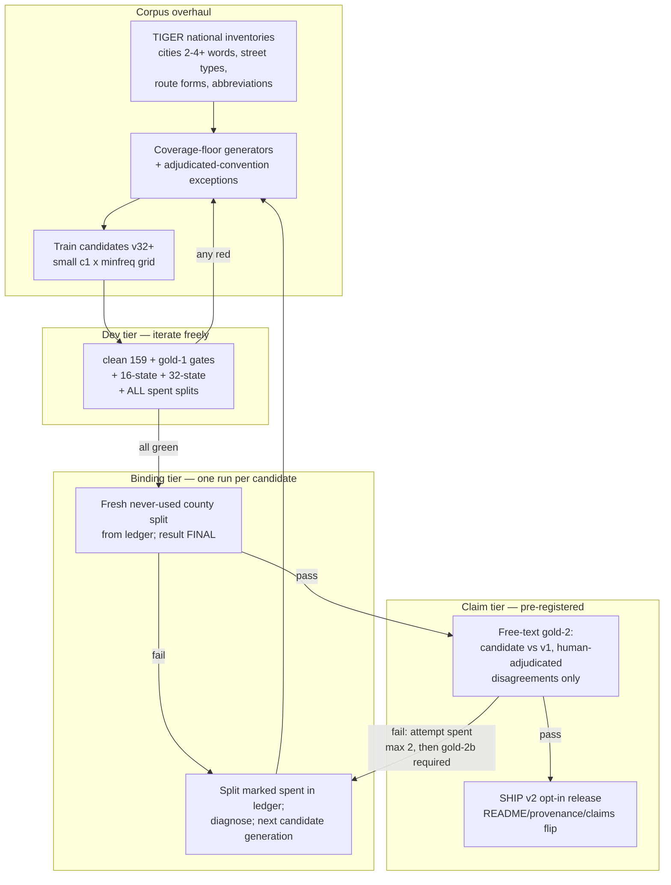

# feat: Ship model v2 — highest national accuracy, independence intact

## Summary

Nine candidates (v19–v31) produced a model that beats the original in 18 of 20 fresh counties and
still cannot ship, because it fails concentrated classes in specific places (Tucson's Spanish
street types, Cobb County GA) and because every benchmark we iterate against stops being
evidence. This plan gets one candidate legitimately over every bar: replace per-failure generator
patching with **vocabulary-complete synthesis derived from Census data**, fix the diagnosed
classes, adopt a **retry discipline that spends evaluation independence deliberately**, build the
**free-text national gold set** that is the only honest basis for a public "better across the
country" claim, and ship the opt-in API surface. The default model stays bit-identical
throughout (decided: Option A, see origin R2/R6 lineage).

User directive anchoring this plan: *best possible v2, highest accuracy across the country* —
quality over schedule. The launch does not wait for v2 (current published stance); v2 ships as
its own release when it passes.

---

## Problem Frame

Three problems compound:

1. **The remaining errors are vocabulary, not logic.** Every fresh-county failure class traces to
   words the training corpus never showed in the right frame: Spanish street types (`E Cmo
   Amistoso` — 268 both-wrong in one Tucson county), three-word city names (`Fair Oaks Ranch`,
   `Sun City Center`, `Town and Country` — coverage stopped at two-word cities), French types
   (`Rue Avallon`), regional abbreviations (`Cty A6`, `Hts`, `Wynd`). Hand-picked lists keep
   losing to the actual national inventory; the inventory exists in TIGER and must be enumerated,
   not guessed.
2. **Evaluation independence is the scarce resource.** The pattern across nine candidates is
   exact: every split we iterated against, we eventually passed (gold, 16-state, 32-state);
   both splits we had never touched, we failed (32-state on first contact, 20-county binding).
   Retrying without a discipline is split-shopping and would make a future pass meaningless.
3. **No national claim without free-text.** The protocol (origin R11) bars accuracy claims not
   backed by an independently auditable evaluation, and composed Census text cannot carry a
   claim about real-world addresses. The existing gold set is 75% two states.

---

## Requirements

- **R-A (net national)**: v2 beats v1 net on never-touched geography, with no state/county worse
  than 3:1 on divergent records — measured on a binding split used exactly once. The per-geography
  3:1 test binds only where a geography has ≥20 divergent records (the qualifier the existing
  binding-split tooling already uses); below that, geographies roll up to the state level. This
  threshold is recorded in the ledger with the split spec, before the run.
- **R-B (no regression)**: clean set stays 159/159; every human-adjudicated verdict stays
  satisfied (known loss Anchor Point must be won or explicitly re-accepted); every previously
  passed split stays green (cumulative, not just the newest).
- **R-C (free-text national gate)**: a state-stratified, free-text gold set (~30/state) with
  pre-registered gates and human adjudication limited to model-disagreement records. Public
  "national accuracy" language unlocks only on this gate.
- **R-D (opt-in surface)**: `model=` selection in the Python API; default path bit-identical and
  untouched (Option A, decided 2026-08-15).
- **R-E (publication discipline)**: every attempt, pass or fail, lands in the findings report and
  README accuracy record with the disclosure language; claims phrased per PROTOCOL.md.
- **R-F (statistical honesty)**: one binding attempt per candidate **generation**, where a
  generation is a committed corpus/recipe changeset carrying a pre-registered failure diagnosis
  and intended fix — grid cells within one corpus share a single binding attempt via dev-tier
  selection, and a tweak-and-retrain does not mint a new generation without a new committed
  diagnosis. Binding splits draw from never-used counties; the ledger makes "never-used"
  auditable; and the ship-time findings report must state the **cumulative count of binding
  attempts across all generations**, so the final pass is interpretable against the number of
  tries.

---

## Key Technical Decisions

1. **Vocabulary-complete synthesis replaces per-failure generators.** Extract national
   inventories from TIGER FEATNAMES/PLACE: all multi-word city names (2, 3, 4+ words — the
   two-word cap was the source of three separate failure rounds), the full pre-type/post-type
   frequency tables (captures Camino/Calle/Paseo/Vía/Rue and their abbreviations Cmo/Cll/Pso as
   they actually occur, plus Wynd/Hts/Cty-class rarities), and route designator forms. Generators
   consume the inventories; hand lists survive only as documented exceptions carrying adjudicated
   conventions. Rationale: five iterations of whack-a-mole each fixed a list that was too small;
   the sixth list should be the census of the vocabulary itself.
2. **Guaranteed coverage with frequency floor.** Every inventory item appears a minimum number of
   times across frames (the v28 lesson: sampling 1,549 cities into thin slots taught nothing);
   high-frequency items scale up but never crowd the floor (the v27 lesson: exposure, not
   contradiction, was the binding constraint).
3. **Evidence ladder with an independence budget — for every tier, including the claim tier.**
   Three tiers: *dev* (clean + gold-1 + 16-state + 32-state + all spent splits — iterate freely),
   *binding* (a fresh, never-used county split — one run per generation, result final), *claim*
   (free-text gold-2). Spent counties are recorded in a ledger; ~3,000 US counties remain unused.
   A candidate ships only when green on all three tiers in one pass.

   Two honesty rules the first draft of this plan missed, both from adversarial review:

   - **Gold-2 is spendable too.** A failed claim-tier run whose diagnosis feeds the next
     generation spends gold-2 exactly the way gold-1 was spent. PROTOCOL2 pre-registers a
     maximum of **two** gold-2 scoring attempts; any public claim must disclose the attempt
     count; exhausting the budget forces a fresh gold-2b built from unused sources before any
     further claim-tier run. The evaluation-assets table reflects this.
   - **The binding tier is re-scoped to what it can honestly test.** Vocabulary-complete training
     from TIGER makes TIGER-composed binding splits easy *by construction* — geographic novelty
     was only ever a proxy for vocabulary novelty, and this plan deliberately removes the proxy.
     Composed binding evidence therefore certifies **coverage and non-regression**, not transfer;
     transfer evidence for the national claim rests on gold-2 alone, and the claims language says
     so. To keep the binding tier discriminating at all, each binding draw is stratified to
     include at least one hard-class geography from the U1 taxonomy (e.g., a high-Spanish-pre-type
     county).
4. **Free-text gold-2 from multi-state owner-mailing sources.** County assessor/tax-roll
   owner-mailing fields (true free text, the messiest real source, per gold-1 methodology)
   sampled across all states via open-data portals, stratified ~30/state; prelabel → LLM review →
   human adjudication **only where v1 and the candidate disagree** (the margin arithmetic makes
   agreeing records worthless to judge — established method). Estimated human burden: one to two
   bounded review rounds.
5. **Both models embed in the wheel.** Runtime model loading already exists in the Rust engine;
   the Python surface gains `model="v2"` on parse/tag functions. Wheel grows ~0.3MB to ~1.1MB —
   acceptable against the no-download install promise.
6. **Recipe re-grid after corpus overhaul.** The current hyperparameters were tuned for a
   corpus that no longer exists; a small grid (c1 × minfreq) re-run guards against carrying a
   stale optimum into the decisive attempt.

---

## High-Level Technical Design

Evaluation assets and their status:

| Asset | Type | Iterated against? | Role going forward |
|---|---|---|---|
| Clean set (159) | free-text, upstream | never | regression gate, every run |
| Gold-1 (1,500, human verdicts) | free-text, regional | v19–v23 | regression gate (verdicts fixed) |
| 16-state scan (~108k) | composed | v24–v28 | dev tier |
| 32-state holdout (~126k) | composed | v29–v31 | dev tier |
| 20-county final split | composed | spent 2026-08-15 | dev tier (cumulative green) |
| Fresh binding splits | composed | never (by rule) | binding tier: coverage/non-regression, one run each, hard-class-stratified |
| Gold-2 (~1,500 free-text, stratified) | free-text, national | never; budget: max 2 scorings, then gold-2b | claim tier — sole transfer evidence |

---

## Implementation Units

### U1. Full failure taxonomy of the spent binding split

**Goal:** Every candidate-wrong and both-wrong record in the 20-county validation classified into
named classes with counts — Cobb GA diagnosed (currently unknown), AZ Spanish types quantified,
the 3+-word-city and abbreviation classes sized.
**Requirements:** R-A.
**Dependencies:** none (the split is already spent; using its failures is what "spent" means).
**Files:** `benchmark/taxonomy_final_split.py` (new), `benchmark/results/final-split-taxonomy.md` (new).
**Approach:** The validation run cached no per-record outputs (its script prints summary counters
only), so the taxonomy tool first re-derives the split via the exact recorded SEED/county-list/
filter path, dumps per-record JSONL (raw, gold labels, v1 labels, candidate labels) to
`benchmark/results/`, and **asserts the regenerated divergence counters match the recorded
2026-08-15 totals before any classification runs** — a drifted reconstruction silently classifies
the wrong record set. Then the ME/TN-style signature clustering (session methodology, committed
here as code for the first time) runs over all 20 counties and both failure buckets, producing a
ranked class table with exemplars. Both-wrong classes (768 records — larger than the loss bucket)
are in scope because "highest accuracy possible" targets them too, not just win/loss flips.
**Test scenarios:** Test expectation: none — analysis tooling over cached eval outputs; correctness
is reviewed via the taxonomy report, not unit tests.
**Verification:** Taxonomy report accounts for ≥95% of candidate-wrong AND both-wrong records in
named classes; Cobb GA class named with count and exemplars.

### U2. National vocabulary inventories from TIGER

**Goal:** Data-derived inventories replacing hand lists: all multi-word place names (no word-count
cap), street pre-/post-type frequency tables (Spanish/French/regional forms and abbreviations
included), route designator forms — each with national frequency counts.
**Requirements:** R-A (KTD 1).
**Dependencies:** U1 (classes tell us which inventory dimensions are load-bearing).
**Files:** `training/build_vocab_inventories.py` (new, supersedes `build_city_vocab.py`),
`training/vocab_inventories.json` (generated, committed for reproducibility).
**Approach:** PLACE files are per-state; **FEATNAMES files are per-county (~3,200 nationally)** —
the sweep enumerates all county FIPS from the national TIGER COUNTY file (one download), then runs
a resumable per-county FEATNAMES fetch into the existing outside-OneDrive cache, with the manifest
recording the county count so "national" is auditable. Sampling a county subset is exactly the
shortcut that loses the rare regional forms this inventory exists to capture, so partial sweeps
are marked as such in the manifest and never presented as national. Emit frequency-ranked
inventories; keep the Census-bookkeeping-name filter. Existing adjudicated
conventions (route designators as pre-types, `#`-identifier rule, etc.) remain enforced by the
validators, which stay in force unchanged.
**Patterns to follow:** `training/build_city_vocab.py` (fetch/cache/extract shape),
`training/validate_synth.py` and `validate_tiger.py` (convention assertions).
**Test scenarios:** Inventory build asserts: every entry round-trips `usaddress.tokenize`; no
bookkeeping names (hyphen/slash/paren) present; spot inventory contains known exemplars from U1
taxonomy (`Cmo`, `Camino`, `Fair Oaks Ranch`-class 3-word cities, `Wynd`, `Cty`) — these are
build-time assertions in the script, not a separate test suite.
**Verification:** Inventories cover 100% of U1's named-class vocabulary; manifest records source
files and counts.

### U3. Coverage-floor generator rewrite and corpus build

**Goal:** One generator family consuming U2 inventories with a guaranteed per-item floor and
frequency-proportional headroom, replacing the accreted micro-generators; adjudicated-convention
exceptions preserved explicitly.
**Requirements:** R-A, R-B (KTD 1, 2).
**Dependencies:** U2.
**Files:** `training/synth_national.py` (new), `training/validate_synth_national.py` (new),
`training/synth_error_classes.py` (reduced to adjudicated-convention exceptions with citations),
`training/train.py` (new `--national` corpus flag).
**Approach:** Frames carry over from the current generators (they encode adjudicated rulings —
each retained frame keeps its citation comment); what changes is vocabulary feed and the coverage
floor. Case/tail noise via the established `add_noise` path. The contradiction filter and the
directional-first-city exclusion carry over — those were hard-won.
**Execution note:** Characterization-first — before replacing generators, snapshot current corpus
label distributions per frame so the rewrite's diff is reviewable.
**Test scenarios:** Validator asserts label-set membership, tokenize round-trip, convention rules
(existing suite); coverage assertion: every inventory item ≥ floor count across frames; a
frame-by-frame label-distribution diff against the snapshot exists and is human-reviewed;
known-tension pairs stay separated (dir-before-plain-city stays directional / dir-word-city stays
city; `N New Orleans` vs `South Portland` both correct in the built corpus by construction).
**Verification:** Corpus builds deterministically under SEED; validators green; distribution diff
reviewed and committed.

### U4. Candidate training with recipe re-grid

**Goal:** Candidates v32+ trained on the overhauled corpus with a small hyperparameter grid; best
dev-tier candidate selected.
**Requirements:** R-A, R-B (KTD 6).
**Dependencies:** U3.
**Files:** `training/train.py` (grid runner or invocation docs), `training/MANIFEST-*.json`
(per-candidate, existing convention).
**Approach:** Grid over c1 × minfreq (the M-U5 grid shape from the v2 plan lineage), each cell
gated by the fast checks (clean + gold-1) before the expensive scans run. Model artifacts and
manifests committed per existing convention.
**Test scenarios:** Test expectation: none — training runs; selection is governed by U5's gate
battery, not tests.
**Verification:** At least one candidate green on clean 159/159 and gold-1 verdicts before dev-tier
scans run; grid results tabulated in the findings report.

### U5. Dev-tier gauntlet: one command, cumulative greens, spent-split ledger

**Goal:** A single driver that runs every dev-tier check (clean, gold-1, 16-state, 32-state, all
spent splits) and refuses to bless a candidate unless all are green; a committed ledger of county
splits with spent/unspent status making "never-used" auditable.
**Requirements:** R-B, R-F (KTD 3).
**Dependencies:** U4 (first consumer), but buildable in parallel from U1.
**Files:** `benchmark/gauntlet.py` (new, extends `gate_candidate.py`), `eval/SPLITS.md` (new
ledger), `benchmark/final_validation.py` (generalized to take a split spec instead of a
hardcoded county list).
**Approach:** Ledger lists every split ever used (the 16-state scan's 18-county corpus, the 32-state holdout,
the 20-county final split, gold sources) with dates, role, and spent-by. Fresh binding splits are drawn by sampling
unused counties, recorded in the ledger *before* the run (the pre-commit pattern, now enforced by
tooling instead of discipline).
**Test scenarios:** Gauntlet exits nonzero if any sub-check fails (verify with the known-failing
v28 artifact as fixture); refuses to run a binding split whose counties intersect the ledger's
used set (fixture test with a deliberately overlapping spec); ledger entries are append-only —
driver errors if an existing entry changed.
**Verification:** `python benchmark/gauntlet.py --candidate <m>` reproduces all current results
for v31 in one invocation; ledger review shows every historical split accounted for.

### U6. Free-text gold-2: sources, sampler, and pre-registered protocol

**Goal:** ~1,500 true free-text addresses stratified ~30/state from multi-state open-data
owner-mailing sources; PROTOCOL-2 with gates pre-registered **before any candidate is scored**.
**Requirements:** R-C (KTD 4).
**Dependencies:** none (parallel track; must complete before U8's claim tier).
**Files:** `eval/gold2/PROTOCOL2.md` (new), `benchmark/fetch_gold2.py` (new),
`eval/gold2/candidates.jsonl` (new), `tools/make_gold2_review_doc.py` (adapted from
`make_confirmation_doc.py`).
**Approach:** Source discovery per state: county assessor portals (Socrata/CKAN/ArcGIS open data)
with owner-mailing free-text fields, following the gold-1 sourcing rule (composed and
distant-supervised text ineligible). States without reachable free-text sources are documented as
gaps in PROTOCOL2 rather than silently backfilled with composed text. Source-map discovery runs
as the **first action** of this track, so a coverage shortfall surfaces before the corpus
overhaul is sunk cost.

Gates and rules to pre-register in PROTOCOL2, all before any candidate is scored:

- **Margin gate:** candidate-vs-v1 net margin positive with 95% bootstrap CI excluding zero on
  the full set; clean/gold-1 regression gates unchanged.
- **Division gate with a minimum-n rule:** no census division net-negative, applied only where a
  division has ≥10 divergent records (at ~2.7% disagreement rates a division yields 2–8
  divergents, and an un-thresholded gate converts one unlucky verdict into a burned attempt);
  sub-threshold divisions are reported but non-gating — mirroring the binding tier's ≥20 rule.
- **Coverage floor for the word "national":** claim language requires all 9 census divisions
  represented and ≥40 states; below the floor, pre-drafted enumerated-coverage phrasing ("better
  across N states") applies instead. The floor is fixed now, not at scoring time.
- **Two pre-committed language tiers:** the CI gate alone unlocks "measurably better than
  usaddress on a stratified national free-text sample (+X pp, CI, attempt count disclosed)"; a
  second, pre-committed effect-size threshold unlocks any stronger headline. Both variants are
  drafted before the run. PROTOCOL2 also carries an explicit limitation note: per-state n≈30
  cannot detect concentrated sub-state failure classes.
- **Adjudication-volume tripwire:** if candidate-vs-v1 disagreements exceed 150 (plausible after
  a from-scratch corpus overhaul; the ≤40-records experience comes from incrementally tuned
  candidates), the gate switches to exhaustive adjudication of a pre-committed random sample with
  a sampling-adjusted margin CI — the human-only standard survives without stalling.
- **Gold-2 spend budget:** maximum two scoring attempts, disclosure of attempt count in any
  claim, gold-2b from unused sources required after exhaustion (KTD 3).

Adjudication scope: disagreement records only, blinded A/B, Census evidence attached
(established flow).
**Execution note:** PROTOCOL2 gates must be committed before the first candidate is scored
against gold-2 — same pre-registration standard as everything else in this project.
**Test scenarios:** Sampler asserts: no overlap with gold-1/clean/training corpora
(normalized-identity dedupe); stratification counts per state within tolerance; every record
carries source URL and fetch date. Covers origin R11's auditability requirement.
**Verification:** PROTOCOL2 committed with gates and source gap list before any scoring;
review-doc generator produces a blinded doc from a fixture disagreement set.

### U7. Opt-in Python API surface for v2

**Goal:** `model="v2"` parameter on `parse`/`tag`/`tag_native` and confidence variants; both
models embedded in the wheel; default path provably untouched.
**Requirements:** R-D.
**Dependencies:** independent of model outcome — buildable now against v31 as a stand-in artifact.
**Files:** `crates/python/src/lib.rs`, `crates/python/pyproject.toml`, `crates/core/src/api.rs`
(model-parameterized entry points exist behind the `model-v2` feature — surface them),
`crates/python/tests/test_dropin.py` (extend), `crates/python/tests/test_model_select.py` (new),
`.github/workflows/wheels.yml` (build with `model-v2` feature).
**Approach:** U7 lands the surfacing code with the `model-v2` feature **default-off**; CI
exercises it via an explicit `--features model-v2` job. The default-on flip moves to U8, landing
in the same commit that promotes the validated artifact — otherwise any wheel cut between U7 and
U8 ships `model="v2"` backed by the unvalidated stand-in, directly against the claims discipline.
Selection is runtime by parameter. Invalid model names raise `ValueError` naming the valid
options.
**Patterns to follow:** existing PyO3 binding conventions in `crates/python/src/lib.rs`; the
RepeatedLabelError compat contract.
**Test scenarios:** default call byte-identical to pre-change behavior on the parity corpus
sample (regression guard); `model="v2"` returns the v2 parse on a known-divergent address
(`S BARRINGTON` class); `model="nope"` raises ValueError listing options; confidence functions
accept the parameter; wheel size asserted < 1.5MB in CI.
**Verification:** Four-layer parity suite green on the default path with the feature enabled;
CI wheels job green; import time still ~quarter second (measured, recorded).

### U8. Binding attempt, claim gate, and the ship flip

**Goal:** The decisive sequence for the selected candidate: fresh binding split (one run) →
gold-2 claim gate → on pass, promote artifact, flip README/provenance/findings/launch-plan
language, cut the v2 release; on fail, publish the miss and loop to the next generation.
**Requirements:** R-A, R-C, R-E, R-F.
**Dependencies:** U4, U5, U6, U7.
**Files:** `model/usaddr_v2.crfsuite`, `model/PROVENANCE.md`, `README.md`,
`benchmark/results/model-v2-findings.md`, `eval/SPLITS.md`.
**Approach:** Ledger draws the split and records it pre-run (U5 tooling). Both outcomes are
pre-scripted: the pass path's claims language is drafted and reviewed *before* the run so success
can't tempt inflation; the fail path publishes with the same prominence (protocol rule). Known
loss Anchor Point: candidate must win it or the release notes re-state it explicitly.

Two additions from review, both mandatory for the ship flip:

- **Both-wrong measurement.** Every gate is relative to v1 and therefore structurally blind to
  the 768 both-wrong records the plan declares in scope. The binding-split report must include
  the candidate's both-wrong rate per U1 class alongside the net-win gate, with the expectation
  of net reduction against the spent-split baseline. Report-mandatory; unmeasured is not an
  option.
- **Field mileage by design, not hope.** The deferred 2.0 default-flip depends on field evidence
  nothing previously generated. The release ships an adopter-facing "when to use v2" README
  section with 3–5 concrete divergent addresses from the U1 taxonomy (v1 vs v2 side by side), a
  one-line recommendation for who should opt in, and an issue template asking for v2 field
  reports.
**Test scenarios:** Test expectation: none — this unit is evaluation and release mechanics;
its correctness is the gauntlet output plus doc review.
**Verification:** All three tiers green in a single pass for the shipped candidate; README
accuracy record, provenance hash, and findings updated in the same commit as the artifact;
disclosure language present in every accuracy statement.

---

## Scope Boundaries

**In scope:** everything required to ship an opt-in v2 with the strongest honest national
evidence; both-wrong improvements (not just win/loss flips).

### Deferred to Follow-Up Work
- Flipping the package default to v2 (loud 2.0 decision, only after field mileage — decided).
- NAD-based unit/apartment enrichment (distinct value: real house numbers, unit fields).
- Constrained decoding (upstream #94) and USPS normalization layer (v1.2 track).
- Quiet-machine speed re-benchmark before the main launch (owned by the launch, not this plan).

### Deferred for later (from origin)
- Multinational parsing (libpostal's scope) — Spanish street types in US addresses are in scope;
  parsing non-US addresses is not.
- LLM-based parsing.

### Outside this product's identity (from origin)
- Any accuracy claim not backed by the gated, auditable evaluation (origin R11) — unchanged and
  load-bearing for every unit above.

---

## Risks & Mitigations

- **Irreducible ambiguity bounds the ceiling.** Some strings are genuinely undecidable without
  local knowledge (`South Portland` vs post-directional). Mitigation: per-(city,state) vocabulary
  coverage is exactly the learnable signal; accept residual both-wrong records and document the
  class.
- **Split-shopping by accident.** Repeated binding attempts erode meaning even with fresh
  counties. Mitigation: ledger + one-attempt-per-generation rule + cumulative greens (R-F);
  attempts are expensive by design.
- **Gold-2 source gaps.** Some states may lack reachable free-text sources. Mitigation: document
  gaps in PROTOCOL2; stratification target degrades transparently rather than silently.
- **Adjudication bandwidth.** Vin's review is the human bottleneck. Mitigation:
  disagreement-records-only scoping has kept every round ≤40 records; gold-2 rounds are budgeted
  the same way.
- **Corpus overhaul destabilizes solved classes.** Mitigation: U3's characterization snapshot +
  the cumulative dev-tier greens; every historical fix is enforced by a validator or a spent
  split, not by memory.

---

## Success Metrics

- Binding split: net candidate-right > v1-right, no qualifying geography beyond 3:1 (≥20
  divergents rule) — on first and only run; both-wrong rate per class reported with net reduction
  vs the spent-split baseline.
- Gold-2: pre-registered gates passed within the two-attempt budget; claim language at the tier
  the evidence earns, attempt count disclosed.
- Zero regressions: clean 159/159, all human verdicts, all spent splits green in the same pass.
- Ship artifact: `model="v2"` in the released wheel; docs, adoption section, and field-report
  channel flipped in the same commit; cumulative binding-attempt count published.

---

## Open Questions (deferred to implementation)

- Cobb GA failure class — named by U1, not guessable now.
- Whether the coverage floor alone clears AZ or Spanish-type frames need dedicated shapes (U3
  discovers via dev tier).
- Gold-2 per-state source map — which states have reachable free-text portals (U6 discovers;
  gaps documented, not fudged).
- Whether Anchor Point becomes winnable under the national corpus or stays a documented loss.
